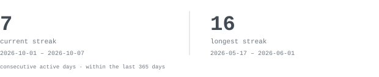
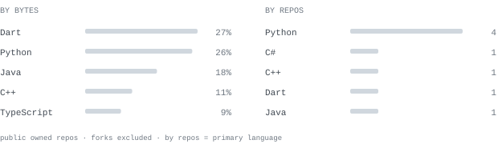
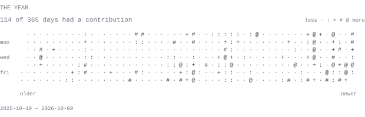

  

**`Software Engineering`** · **`AI Automation Enthusiast`**

  
  

<picture>
  <source media="(prefers-color-scheme: dark)" srcset="./assets/profile-preview/heading-about-dark.svg" />
  
</picture>

  Hi, I'm <strong>Yit Shen</strong>, a second-year Software Engineering student. 
  I enjoy building practical solutions across AI, mobile, web, and automation. 
  I also actively take part in hackathons!

  <strong>Current interests</strong> 
  <code>LLMs</code> · <code>AI Agents</code> · <code>RAG</code> · <code>Automation</code> · <code>Full-Stack</code> · <code>Machine Learning</code>

<picture>
  <source media="(prefers-color-scheme: dark)" srcset="./assets/profile-preview/heading-stack-dark.svg" />
  
</picture>

  

  

<picture>
  <source media="(prefers-color-scheme: dark)" srcset="./assets/profile-preview/heading-projects-dark.svg" />
  
</picture>

|  |  |  |
| --- | --- | --- |
| **[WordPress Blog Automation](https://github.com/51-Shenn/wordpress-blog-automation)** | Turns Google Sheets briefs into SEO blog drafts with AI-selected Pexels images, then uploads them to the right WordPress site. Includes status tracking, error logging, and email notifications.  [Get the n8n template ↗](https://n8n.io/workflows/15814) | <samp>n8n, OpenAI, WordPress, Google Sheets</samp> |
| **[HoopMind](https://github.com/51-Shenn/hoopmind)** | NBA knowledge chatbot built across three conversational AI platforms, with answers grounded in a shared basketball dataset. | <samp>Python, Rasa Pro, Dialogflow ES, Botpress</samp> |
| **[SyncField](https://github.com/51-Shenn/sync-field)** | ImagineHack 2026 team project for construction workforce planning and AI-assisted resource management. | <samp>Next.js, TypeScript, FastAPI, Supabase</samp> |
| **[MyFin](https://github.com/51-Shenn/myfin)** | SME finance app for expense tracking, financial documents, reports, and an AI assistant. | <samp>Flutter, Dart, Firebase, Gemini</samp> |

<picture>
  <source media="(prefers-color-scheme: dark)" srcset="./assets/profile-preview/heading-stats-dark.svg" />
  
</picture>

  <picture>
    <source media="(prefers-color-scheme: dark)" srcset="./assets/profile-preview/contributions-dark.svg" />
    
  </picture>

  <picture>
    <source media="(prefers-color-scheme: dark)" srcset="./assets/profile-preview/streak-dark.svg" />
    
  </picture>

  <picture>
    <source media="(prefers-color-scheme: dark)" srcset="./assets/profile-preview/languages-dark.svg" />
    
  </picture>

  <picture>
    <source media="(prefers-color-scheme: dark)" srcset="./assets/profile-preview/year-dark.svg" />
    
  </picture>

---

  <strong>阅己 &nbsp;·&nbsp; 悦己 &nbsp;·&nbsp; 越己</strong> 
  <em>Always strive for self-improvement.</em>

